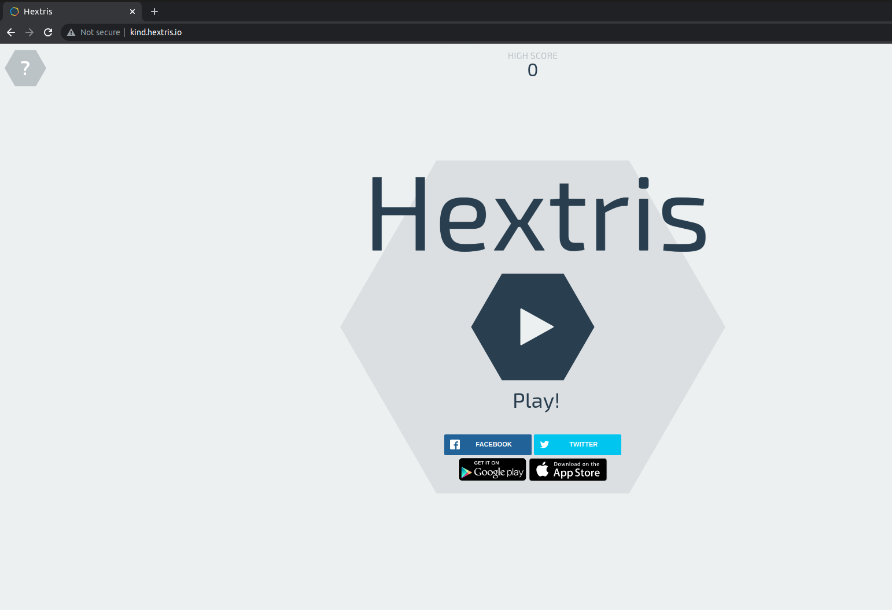

# hextris-helm
This Git repository contains code to provision a local kubernetes cluster(KIND) using Terraform and a helm chart to deploy Hextris (https://hextris.io/) to the kubernetes cluster. 

## system-requirements
Solution tested on a Ubuntu 20.04 distribution.Prerequisites and corresponding versions are as below:

* docker - 20.10.12+
* terraform - 1.1.7+
* kubectl - 1.20
* helm - 3.8.0+

## Local Kubernetes Cluster setup with Terraform

Kind is used as a local kubernetes cluster to deploy the application. Kind is a tool for running local kubernetes clusters using Docker conatiner nodes. 

An existing terraform providers is used to provision a kind cluster with 1 control plane node and 2 worker nodes. 

kind provider and corresponding version is added to versions.tf file and terraform resource to create kind cluster is present at kind.tf

Cluster name and Node Image(A docker image for running k8s components) are defined as variables in variables.tf file and these need to be declared in terraform.tfvars file. 

## Helm Chart to Deploy Hextris to Local Kind cluster

### Building the Docker Image

As part of creating a helm chart for the game, a docker image is created with the source code of the application. Here is the Dockerfile used: 

```
FROM nginx:alpine

MAINTAINER sharath

COPY . /usr/share/nginx/html
```

We need to build,tag and push the docker image to the docker hub. 

```
docker build -t hextris:v1 .
docker tag hextris:v1 sharathvutpala/hextris-k8s:v1
docker push sharathvutpala/hextris-k8s:v1
```
### Helm Chart Overview

``` bash

├── charts/
├── Chart.yaml
├── templates/
│   ├── deployment.yaml 
│   ├── service.yaml   
│   ├── ingress.yaml 
│   ├── hpa.yaml
│   ├── _helpers.yaml
│   ├── NOTES.txt 
├── values.yaml 

```
Helm chart is deployed to the local KIND cluster with terraform Helm Provider. 

### Add-ons

1. Nginx Ingress Controller -To expose the application as an Ingress resource
2. Metrics Server - To Horizontally scaling up the pods 

These add-ons are installed in the cluster once cluster is ready with the help of a null_resource with  **local-exec** provisioner. 

***HPA and Ingress features can be disabled in by changing the settings in values.yaml file***

## Creating KIND Cluster and Application Deployment

Terraform is used to Create the local KIND Cluster, Deploy Hextris Helm Chart to the cluster and Install add-ons mentioned above. All terraform commands mentioned below need to be run from the root of the repo. 

```bash
terraform init
terraform plan
terraform apply
```
Once terraform apply is completed, a kubeconfig file is created in the root of the repo and this needs to be exported to access the local kubernetes cluster. 

``` bash
export KUBECONFIG=hextris-local-config
```

A sample kubectl command can be run to see the cluster status. 
```
$kubectl get nodes
NAME                          STATUS   ROLES    AGE     VERSION
hextris-local-control-plane   Ready    master   7m48s   v1.19.1
hextris-local-worker          Ready    <none>   7m14s   v1.19.1
hextris-local-worker2         Ready    <none>   7m14s   v1.19.1
$
```


### Accessing the Application

**If Ingress is enabled**:  ingress host name mentioned in the values.yaml (kind.hextris.io) needs to be mapped to the ip address of the control-plane node in /etc/hosts file and application can be accessed at http://kind.hextris.io

**If Ingress is disabled**: Port Forwarding can be done to access the application 

```
kubectl port-forward service/hextris 8080:80
```




**References**

* https://kind.sigs.k8s.io/
* https://registry.terraform.io/providers/unicell/kind/latest